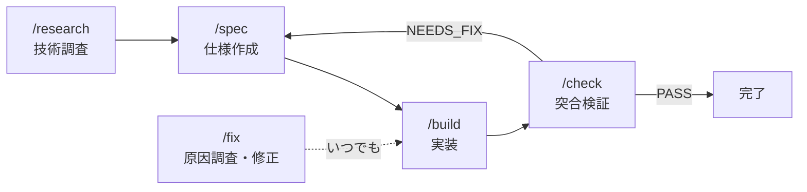

Claude Code のプランモードで計画を立ててから実装する、という流れ自体はできます。でもガチガチの仕様駆動開発（SDD）は重い、、、
もっと軽く、でも仕様と実装の同期は保ちたい。そう思って作ったのが [spec-flow](https://github.com/884js/spec-flow) です。

research→spec→build→check の4フェーズをスラッシュコマンドで切り替えながら、仕様と実装を同期させ続ける Claude Code プラグインを勉強も兼ねて作ってみました。

## TL;DR
  - AIが実装方法を自分で判断できるようになってきたので、仕様書に必要なのは実装の詳細ではなく、外れてはいけない境界だけでいい
  - 仕様→実装→検証→仕様に戻る、のサイクルをClaude Codeプラグインにした

## AI にプランを書かせると、仕様書が実装ガイドになる

プランモードで計画を書かせていて、ちょっと困ったことがありました。

**AI に実装プランを書かせると、実装コードまで含めがち。**

たとえばこんな感じです。

```markdown
<!-- ありがちな plan.md -->
## API 設計
- POST /api/tasks

### リクエスト型
\```typescript
interface CreateTaskRequest {
  title: string;
  description?: string;
  assigneeId: number;
}
\```

### Prisma スキーマ
\```prisma
model Task {
  id          Int      @id @default(autoincrement())
  title       String
  description String?
  assigneeId  Int
  createdAt   DateTime @default(now())
}
\```
```

丁寧ではあるんですけど（むしろ丁寧すぎる）、仕様と実装の境界がぼやけて、「この仕様書の通りに実装して」と言ったときに AI がコードをコピペするだけになってしまいます。

自分が欲しかったのはこういう仕様書でした

```markdown
<!-- 欲しかった plan.md -->
# タスク作成機能

## 概要

チームメンバーがタスクを作成し、担当者を割り当てられるようにする。

## 受入条件

- [ ] AC-1: タスク名と担当者を指定してタスクを作成できる
- [ ] AC-2: タスク名が空の場合はエラーになる
- [ ] AC-3: 存在しない担当者を指定した場合はエラーになる

## データフロー

\```mermaid
sequenceDiagram
    participant User
    participant UI as タスク作成画面
    participant Server
    participant DB

    User->>UI: タスク名・担当者を入力
    UI->>Server: POST /api/tasks
    Server->>DB: INSERT task
    DB-->>Server: 保存結果
    Server-->>UI: 201 Created
    UI-->>User: タスク一覧に遷移
\```

## API 設計

| メソッド | パス | 説明 |
|---------|------|------|
| POST | /api/tasks | タスク作成 |

- 作成時の入力: `title`, `assigneeId`, `description`（任意）
- 主要なエラーケース:
  - title が空の場合 → 400 Bad Request
  - 存在しない担当者を指定した場合 → 404 Not Found
```

書いてほしいのは「何を作るか」を決める仕様書であって、「どう実装するか」を書いた技術仕様書ではない。API のパスやカラムは表で書けばいいし、実装コードは AI に任せればいい。

こういうフォーマットで書いてほしいと毎回指示するのはめんどいし、CLAUDE.md や rules に書いておくこともできるけど、それだけだと「仕様を書く→実装→検証→仕様に戻る」のサイクル全体は回せません。

仕様書の役割を明確にした上で、調査→仕様→実装→検証のフローを体系化できないか。そう考えていたとき、[ある記事](https://boristane.com/blog/how-i-use-claude-code/)で紹介されていたワークフローがヒントになりました。Research → Plan → Annotation → Implement の4ステップで、「計画を承認するまでコードを書かせない」という原則です。これを Claude Code のプラグインとして体系化したのが spec-flow です。

## research→spec→build→check のサイクル

spec-flow の核心は、4つのフェーズが一つのサイクルとして回ることにあります。



**research** — 技術調査です。ライブラリの比較やアーキテクチャの検討を行い、`research-{日付}-{topic}.md` に結果を出力します。spec の実行時に自動で読み込まれるので、調査結果が仕様に反映されます。

**spec** — 要件ヒアリングと plan.md の生成です。「何を作るか」を対話で明確にして、仕様書を生成します。このとき analyzer というサブエージェントが、プロジェクトの既存コード・規約・ディレクトリ構造を独立したコンテキストで分析します。メインの会話が大量のコード情報で埋まることなく、分析結果だけが返ってくるので、既存のコードベースと一貫した仕様が出てきます。

**build** — plan.md に基づく実装です。ブランチを作って、タスク順に実装して、ビルド確認して、PR を作る。ここは特に変わったことはしていません。仕様通りに実装するだけです。

**check** — 仕様と実装の突合検証です。ここが重要で、後で詳しく書きます。

**fix** — バグや問題が起きたときの原因調査と修正です。サイクルのどのタイミングでも独立して使えます。推測での修正を禁止し、実行フローを追って原因を完全に特定してから修正方針を提示します。plan.md があればそれを参照しながら調査し、なくても単独で動きます。

このサイクルの価値は、**各フェーズの成果物が次のフェーズの入力になる**ことです。調査結果が仕様に反映され、仕様が実装の指針になり、実装が検証の対象になる。そして検証で問題が見つかれば、仕様にフィードバックされます。

手動でやると「research の結果を spec に渡し忘れる」「build 後に check を忘れる」ということが起きがちです。プラグインにすることで、このサイクルが自然に回ります。

## AI 実装後の「合ってるよね？」を自動化した

AI にコードを書かせた後、一番手間だったのが**要求通りに実装されているかの確認**でした。

diff を見ても、コード量が多いと全部は追えません。「このロジック、仕様と合ってるよね？」を一つずつ手動で確認するのはつらい。特にバックエンドの API やデータベースの整合性は、コードを読むだけでは見落としやすいです。

spec-flow の `check` は、plan.md と実装コードを**双方向に突合**します。

- **仕様→実装**: plan.md に書いた受入条件が、実装コードで満たされているか
- **実装→仕様**: 実装されているコードに、plan.md で言及されていない機能がないか

片方向の検証だけだと「仕様にない実装」が見逃されます。双方向にすることで、仕様漏れと実装漏れの両方を検出できます。変更ファイルが多い場合はドメイン別に verifier サブエージェントを並列実行するので、大きな変更でも検証が速いです。

検証結果は `result.md` に出力されます。たとえばこんな形です。

```markdown
## 検証結果: NEEDS_FIX

| 受入条件 | 判定 | 詳細 |
|---------|------|------|
| AC-1: タスク一覧APIが正しく動作する | PASS | GET /api/tasks が実装済み、ページネーション対応 |
| AC-2: タスク作成時にバリデーションが行われる | NEEDS_FIX | title の文字数制限（100文字）が未実装 |
| AC-3: 担当者への通知が送信される | PASS | NotificationService 経由で実装済み |

### 仕様外の実装
- `DELETE /api/tasks/:id` が実装されているが、plan.md に記載なし
```

PASS / PARTIAL / NEEDS_FIX の判定がつき、NEEDS_FIX の場合はどの受入条件がどう満たされていないかが具体的に記載されます。「仕様外の実装」も検出するので、意図しない機能の混入にも気づけます。

## 仕様は変わる前提で設計した

SDD に対する一番の懸念は「仕様を最初に全部決めないといけないんじゃないか？」だと思います。

実際には、仕様は後から変わるし、実装中にも変わります。「最初から全部決まった仕様で実装できる」なんてことはまずありません。

spec-flow はこの前提で作りました。仕様は変わるものだから、**変わったときにちゃんと追従する仕組み**を用意しています。

### check → spec の更新ループ

check で NEEDS_FIX が出ると、spec の更新モードがトリガーされます。実装の実態に合わせて plan.md を修正し、再度 check を実行する。仕様と実装のズレを放置しません。

```
spec → build → check (NEEDS_FIX) → spec (更新モード) → build → check (PASS)
```

### Annotation Cycle

spec で生成された plan.md を、ブラウザで開いてレビューできます。

plan.md の任意のセクション見出しをクリックするか、テキストを選択してコメントを付けられます。「この受入条件、〜のケースも必要では？」「API のパスは /v2/ にしたい」といった指摘を、仕様書の該当箇所に直接書き込めます。


*受入条件の項目にコメントを付けている様子*


*API設計セクションへのフィードバック*


*設計判断の根拠に対して質問している様子*

コメントを送信すると AI が plan.md を自動修正し、変更前後の差分がハイライト表示されます。修正内容を確認して、さらにコメントを付けることもできます。納得するまで何回でもこのサイクルを回せます。


*コメントを受けて AC-4 に再接続の仕様が追加された*


*ページネーションのパラメータが追加された*

要するに、仕様は「確定したら変えられない契約書」ではなく、**会話しながら育てるもの**として扱っています。

## 仕様書は「設計図」ではなく「ガードレール」

Claude Code が賢くなった今、仕様書に求められる役割が変わったと思っています。以前は「この通りに実装して」という設計図が必要でした。でも今の AI は、API のパスと受入条件さえ決めておけば、実装方法は自分で判断できます。

だから spec-flow の plan.md は「設計図」ではなく「ガードレール」にしました。ソースコード — TypeScript、Prisma schema、SQL — は一切含めません。API のパスやカラム名、型は表や箇条書きで書く。「ここは外れちゃだめ」という境界だけ決めて、実装の自由度は AI に残します。

## 導入の手軽さ

npm も Python も不要で、Claude Code から一発で導入できます。

```
/plugin marketplace add 884js/spec-flow
```

状態管理も `state.json` のような明示的な状態ファイルは持たず、ファイルの存在そのものでフェーズを判定します（`plan.md` があれば spec 完了、`result.md` があれば check 完了）。壊れたら消してやり直せばいい（この気軽さが大事）。

## 作るときに役立ったアプローチ

ここからは spec-flow を作る中で見つけた、プラグイン開発に使えるアプローチを紹介します。

### スキルとエージェントを分ける
spec-flow ではスキル（`/spec`、`/build` など）がワークフローの制御を担い、エージェント（analyzer、verifier など）が実処理を担う構成にしました。スキルがオーケストレーション、エージェントが実行。この分離のおかげで、たとえば check スキルが verifier エージェントを並列起動するような構成が自然に書けました。

### skill-creator で評価を回す
[anthropics/skills の skill-creator](https://github.com/anthropics/skills/tree/main/skills/skill-creator) を使って、スキルの品質を評価しました。入力に対して期待通りの出力が返ってくるかを評価シナリオとして定義し、ベースライン測定 → スキル修正 → 再測定のサイクルで改善していきました。

### ベストプラクティスをスキル化する
[公式ドキュメントのベストプラクティス](https://platform.claude.com/docs/en/agents-and-tools/agent-skills/best-practices)自体をスキルとして組み込みました。実装中にベストプラクティスに沿っているかを自動でチェックさせる仕組みにすることで、スキルの品質がかなり上がりました。

### 「1から作り直すならどんな構成が良いですか？」と聞く

開発を進めていると、スキルやエージェントの構成が複雑化してきます。そういうときに AI に「今のコードを全部見た上で、1から作り直すならどんな構成にしますか？」と聞いてみてください。返ってきた理想構成と現状を比較することで、どこをリファクタリングすべきかが明確になります。

## 今後やりたいこと

### Annotation Cycle のライブリロード

現在の Annotation Cycle は、plan.md を修正するたびにサーバーを再起動してブラウザを開き直す必要があります。ポーリングベースのライブリロードを入れて、ブラウザを開きっぱなしにしたまま変更が自動反映されるようにしたいです。

### 既存コードとの整合性検証と Hooks フェーズ遷移

既存コードがあるプロジェクトで spec-flow を使うとき、新しい仕様が既存コードにどう影響するかを明示的に検証する仕組みがほしいと思っています。analyzer が既存コードの影響分析を出力し、check で既存コードへの副作用も検出できるようにする。また、build が完了したら `/check` を、check で NEEDS_FIX が出たら `/spec` を自動提案する Hooks も入れたいです。フェーズの切り替えを人間が覚えておく必要がなくなります。

## まとめ

このプラグインを作りはじめたときは、API仕様・DB設計・フロント設計書などを詳細に作り込むことを目指していました。でも作っていくうちに、AIに仕様の意図を汲んで実装方法を自分で判断させるほうがいいのでは？と考えて方向転換しました。

実際に活用していく中で気づいたのは、今のAI開発に必要なのは詳細な仕様書ではなく、**外れてはいけない境界**だということです。

今AIに足りていないのは記憶力と実装速度なので、今後そこが改善されていけば、あらかじめ仕様書をしっかり書く場面も減ってくるとは思います。

ここまで読んでいただきありがとうございました。

- GitHub: [884js/spec-flow](https://github.com/884js/spec-flow)
- インストール: `/plugin marketplace add 884js/spec-flow`
