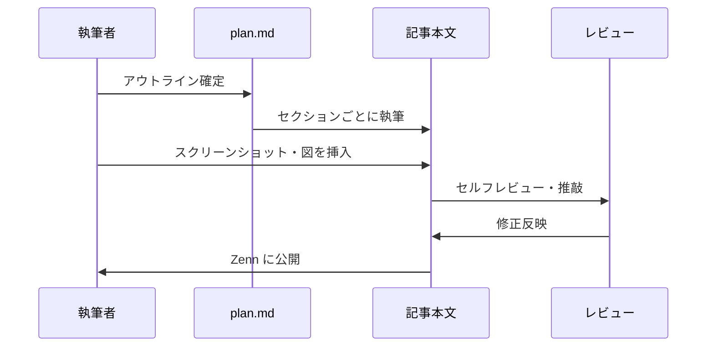
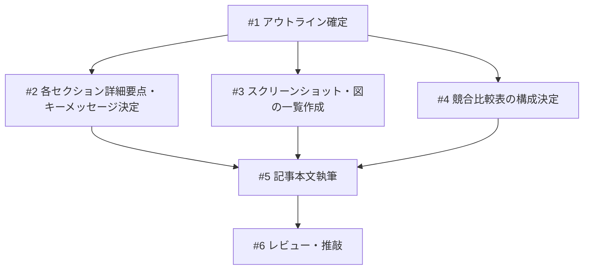

# spec-flow Zenn 記事執筆

## 概要

spec-driven-dev（spec-flow）プラグインの価値を伝える Zenn 単体記事を執筆する。既存 SDD ツールへの不満（ドキュメントが厚い、仕様が固定される、フローが重い）を起点に、Boris Tane 的な research→plan→implement ワークフローを Claude Code プラグインとして体系化した話として構成する。最も推すポイントは research→spec→build→check のフローサイクルとする。

## ユーザーストーリー

- US-1: AI コーディングユーザーとして、仕様と実装の乖離不安を解消する方法を知りたい。なぜなら AI が生成したコードが仕様通りか確認する手段がないから。
- US-2: Claude Code ユーザーとして、軽量な仕様管理プラグインを見つけたい。なぜなら npm インストールや複雑なセットアップなしで使い始めたいから。
- US-3: 既存 SDD ツールに不満を持つ開発者として、ドキュメントが厚くならない仕様管理の方法を知りたい。なぜなら既存ツールはドキュメントが膨大になりすぎて、もっと軽量にやりたいから。

## 受入条件

- [ ] AC-1: 記事のアウトライン（各セクションの見出し・要点・想定文字数）が明確であること
- [ ] AC-2: 各特徴（check による突合、仕様は変わる前提の設計、軽量さ）が問題→解決策の構造で記述されること
- [ ] AC-3: 「軽量さ」が訴求ポイントとして含まれること（npm/python 不要、Markdown 置くだけ）
- [ ] AC-4: 競合ツール（cc-sdd, Kiro, Spec Kit）との比較が含まれること（軽め）。別途詳細調査が必要なため、公開前に各ツールの最新仕様を再確認する
- [ ] AC-5: 導入を既存 SDD ツールへの不満から始め、Boris Tane 的ワークフローの文脈で spec-flow を紹介すること
- [ ] AC-6: research→spec→build→check のフローサイクルが最も推したいポイントとして扱われること。Boris Tane の記事で紹介されているワークフローを spec-flow が体系化しているという文脈を含むこと
- [ ] AC-7: 記事全体の想定文字数が明記されること
- [ ] AC-8: 「仕様は変わる前提で設計した」という設計思想が記事内で明確に語られること

## スコープ

### やること

- 記事構成の設計（アウトライン、各セクション要点、文字数配分）
- Boris Tane 的ワークフローの文脈整理
- 使用するスクリーンショット・図の一覧
- 競合比較表の構成（公開前に各ツールの最新仕様を再確認）
- 記事本文の執筆・推敲

### やらないこと

- スクリーンショットの撮影（別途実施）
- Zenn Book 形式での執筆
- プラグインの機能追加・改修

## データフロー

### 記事執筆フロー

## 設計判断

| 判断事項 | 選択 | 理由 | 検討した代替案 |
|---------|------|------|--------------|
| 記事形式 | Zenn 単体記事 | 1本で完結する方が読了率が高い | Zenn Book — 分量的に Book にするほどではない |
| 切り口 | 既存 SDD ツールへの不満起点 | 開発者が実際に感じている不満から入ることで共感を得やすい | 問題起点型（3つの不安）— 抽象的すぎる / 機能紹介型 — 共感が得にくい |
| タイトル案 | 「research→spec→build→check のサイクルを Claude Code プラグインで自動化した話」 | フローが最大の訴求点であることを反映。具体性がある | 「AIコーディングで感じた3つの不安と〜」— 不安起点は弱い |
| 競合比較の深さ | 軽め（表＋1段落）。公開前に各ツールの最新仕様を再確認する | 批判的にならず、エコシステムの文脈で位置づける。間違った情報を書かない | 詳細比較 — 記事の焦点がぼやける |
| 最も推すポイント | フローサイクル（research→spec→build→check） | Boris Tane 的なワークフローを体系化したもの。手動でやっている人は多いが、ツール化されていない | Annotation Cycle — 特徴の一つとしては強いが、フロー全体の方が訴求力がある |
| 想定文字数 | 約 5,000-6,000 字 | Zenn 技術記事の適正レンジ（長すぎず短すぎず） | 3,000 字 — 深みが出ない / 8,000 字 — 離脱率が上がる |

## 記事アウトライン

### 全体構成

記事タイトル: 「research→spec→build→check のサイクルを Claude Code プラグインで自動化した話」（仮）
想定読者: Claude Code 日常ユーザー / Kiro・Cursor 経験者 / SDD 懐疑派 / Boris Tane 的ワークフローを手動でやっている人
想定文字数: 約 5,000-6,000 字

### セクション詳細

| # | セクション | 要点・キーメッセージ | 想定文字数 |
|---|-----------|-------------------|-----------|
| 1 | 導入: 既存 SDD ツールへの不満 | 既存の SDD ツールはドキュメントが厚くなりすぎる、仕様が固定される、セットアップが重い。もっと軽量に仕様管理したいという動機 | 400-500字 |
| 2 | Boris Tane 的ワークフローが最適解 | Boris Tane の記事で紹介されている research→plan→annotation→implement のワークフロー。手動でやっている人は多いが、体系化されたツールがない → spec-flow がそれを自動化・体系化した | 600-800字 |
| 3 | フロー全体の紹介（**最も推したいポイント**） | research→spec→build→check のサイクル。各フェーズの役割と、フロー全体が回ることの価値。Mermaid 図で可視化 | 800-1,000字 |
| 4 | 特徴1: 仕様と実装の突合（check） | AI 実装後に「ちゃんとロジックや要求通りになってるよね？」を確認するのが手間だった → check が plan.md と実コードを双方向に突合し、乖離を自動検出 | 700-900字 |
| 5 | 特徴2: 仕様は変わる前提の設計 | 仕様は後から変わるし、実装中にも変わる。最初から全部決まった仕様で実装できない前提で作った → check の NEEDS_FIX→spec 更新ループ、Annotation Cycle がこの思想を体現 | 700-900字 |
| 6 | 特徴3: 軽量さ | npm/python 不要。`.claude/` に Markdown を置くだけ。state.json 不使用のステートレス設計。ドキュメントが厚くならない | 400-500字 |
| 7 | 他のツールとの比較（軽め） | cc-sdd / Kiro / Spec Kit との比較表。各ツールのアプローチの違いを中立的に紹介。**注意: 公開前に各ツールの最新仕様を再確認すること** | 500-700字 |
| 8 | まとめ | フローが回ることの価値を再提示。仕様は「契約書」ではなく「会話しながら育てるもの」。プラグインへのリンク | 300-400字 |

### 各セクションのキーメッセージ

**セクション1（導入: 既存 SDD ツールへの不満）**
- 共感: 既存の SDD ツールはドキュメントが厚くなりすぎる、やりすぎ感がある
- 問題提起: 仕様が固定される、セットアップが重い、フローが煩雑
- フック: もっと軽量にやりたい、という動機を提示

**セクション2（Boris Tane 的ワークフロー）**
- 紹介: Boris Tane の記事（https://boristane.com/blog/how-i-use-claude-code/）で紹介されている research→plan→annotation→implement のワークフロー
- 共感: このようなワークフローを手動でやっている人は多い
- 問題: 体系化されたツールがない → spec-flow がそれを解決

**セクション3（フロー全体の紹介）- 最重要セクション**
- research→spec→build→check のサイクルを図で可視化
- 各フェーズの役割を簡潔に説明
- フロー全体が回ることの価値: 調査に基づいた仕様 → 仕様に基づいた実装 → 実装の検証 → 仕様への反映

**セクション4（特徴1: check — AI 実装後の要求確認）**
- 問題の具体化: AI 実装後に「ちゃんとロジックや要求通りになってるよね？」を手動で確認するのが手間だった
- 解決策: check が plan.md と実コードを双方向に突合し、乖離を自動検出
- 具体例: 検証結果の出力イメージ（テキストで説明）

**セクション5（特徴2: 仕様は変わる前提の設計）**
- 設計思想: 仕様は後から変わるし、実装中にも変わる。最初から全部決まった仕様で実装できない前提で作った
- 体現1: check の NEEDS_FIX → spec 更新ループ（実装の実態を仕様にフィードバック）
- 体現2: Annotation Cycle（人間がブラウザから仕様にコメント → AI が自動修正）
- 思想: 仕様は「確定したら変えられないもの」ではなく「会話しながら育てるもの」

**セクション6（特徴3: 軽量さ）**
- 差別化: 他ツールは npm/python のインストールが必要、ドキュメントが厚くなる
- 訴求: `.claude/` に Markdown を置くだけ、state.json なし
- 公式準拠: Claude Code のスキル+エージェント構成に忠実

**セクション7（競合比較 — 軽め）**
- 中立的: 各ツールのアプローチを「この問題をどう解いているか」で紹介
- 比較表: 提供形態、インストール、仕様-実装突合、レビュー機能の4軸
- spec-flow の位置づけ: 軽量・Claude Code 特化・フローの体系化が独自
- **注意: 公開前に各ツールの最新仕様を再確認すること。間違った情報は書けない**

**セクション8（まとめ）**
- 思想の再提示: フローが回ることの価値、仕様は「会話しながら育てるもの」
- CTA: プラグインマーケットプレイスへのリンク

## 使用するスクリーンショット・図の一覧

| # | 種別 | 内容 | 使用セクション |
|---|------|------|--------------|
| 1 | 図（Mermaid or 画像） | research→spec→build→check のフローサイクル図 | セクション3 |
| 2 | スクリーンショット | check 実行結果（検証レポートの出力） | セクション4 |
| 3 | スクリーンショット | Annotation Cycle のブラウザ画面（インラインコメント入力中） | セクション5 |
| 4 | スクリーンショット | Annotation Cycle の差分ハイライト表示 | セクション5 |
| 5 | 図（Mermaid or 画像） | check NEEDS_FIX → spec 更新ループの図 | セクション5 |
| 6 | 表 | 競合比較表（cc-sdd / Kiro / Spec Kit / spec-flow） | セクション7 |

## 競合比較表の構成

### 比較軸

| 比較軸 | cc-sdd | Kiro | Spec Kit | spec-flow |
|--------|--------|------|----------|-----------|
| 提供形態 | npm CLI | SaaS IDE | Python CLI | Markdown スキル |
| インストール | `npm i -g` | SaaS 登録 | `uv tool install` | `.claude/` に配置 |
| 仕様-実装の突合 | validate-impl（片方向） | Living Document（自動更新） | analyze（片方向） | check（双方向突合） |
| 仕様レビュー機能 | なし | タスク進捗 UI | なし | Annotation Cycle |
| 推測修正の防止 | なし | なし | なし | fix で明示禁止 |
| 対応 AI ツール | 8種類 | Kiro 専用 | 20種類以上 | Claude Code 専用 |
| 価格 | 無料 | 無料〜$39/月 | 無料 | 無料 |

### 比較セクションのトーン

- 批判的にならない
- 「この問題をどう解いているか」という切り口
- spec-flow の弱み（マルチ AI 非対応、EARS 記法なし）にも軽く触れる

> **注意**: 公開前に各ツールの最新仕様を再確認すること。間違った情報は書けないため、比較表の内容は別途詳細調査が必要。

## システム影響

### 影響範囲

- なし（記事執筆のため、プラグイン本体への変更なし）

### リスク

- 先行記事（SDD 概念説明系）と内容が被ると埋もれるリスク → 既存ツールへの不満起点 + Boris Tane 的ワークフローの文脈で差別化
- スクリーンショットの品質が記事の説得力に直結 → フローサイクル図と Annotation Cycle の画面は特に丁寧に作成
- 競合比較で間違った情報を書くリスク → 公開前に各ツールの最新仕様を必ず再確認する

## 実装タスク

### 依存関係図

### タスク一覧

| # | タスク | 対象ファイル | 見積 | 依存 |
|---|--------|------------|------|------|
| 1 | 記事アウトライン確定 | `docs/plans/zenn-article-value/plan.md` | S | - |
| 2 | 各セクションの詳細要点・キーメッセージ決定 | `docs/plans/zenn-article-value/plan.md` | S | #1 |
| 3 | スクリーンショット・図の一覧作成 | `docs/plans/zenn-article-value/plan.md` | S | #1 |
| 4 | 競合比較表の構成決定 | `docs/plans/zenn-article-value/plan.md` | S | #1 |
| 5 | 記事本文執筆 | 記事ファイル（Zenn 記事用 Markdown） | L | #2, #3, #4 |
| 6 | レビュー・推敲 | 記事ファイル（Zenn 記事用 Markdown） | M | #5 |

> 見積基準: S(〜1h), M(1-3h), L(3h〜)

## テスト方針

### トレーサビリティ

| 受入条件 | 自動テスト | 手動検証 |
|---------|-----------|---------|
| AC-1 | - | MV-1 |
| AC-2 | - | MV-2 |
| AC-3 | - | MV-3 |
| AC-4 | - | MV-4 |
| AC-5 | - | MV-5 |
| AC-6 | - | MV-6 |
| AC-7 | - | MV-7 |
| AC-8 | - | MV-8 |

### 手動検証チェックリスト

- [ ] MV-1: 各セクションの見出し・要点・想定文字数がアウトラインに明記されていること
- [ ] MV-2: 各特徴（check、仕様は変わる前提、軽量さ）がそれぞれ「問題の具体化 → 解決策の提示」の構造で書かれていること
- [ ] MV-3: 軽量さ（npm/python 不要、Markdown 置くだけ、state.json 不使用）が明確に訴求されていること
- [ ] MV-4: 競合比較表が含まれ、cc-sdd / Kiro / Spec Kit が取り上げられていること
- [ ] MV-5: 導入が既存 SDD ツールへの不満から始まり、Boris Tane 的ワークフローの文脈で spec-flow を紹介していること
- [ ] MV-6: フローサイクル（research→spec→build→check）のセクションが最も推されたポイントとして扱われていること
- [ ] MV-7: 記事全体の想定文字数（5,000-6,000字）が明記されていること
- [ ] MV-8: 「仕様は変わる前提で設計した」という設計思想が明確に語られ、check→spec ループや Annotation Cycle がその体現として説明されていること

## 参考資料

| 資料名 | URL / パス |
|--------|-----------|
| 市場調査・記事化の価値判断 | `docs/plans/zenn-article-value/research-2026-03-10-zenn-article-value.md` |
| 競合ツール機能比較 | `docs/plans/zenn-article-value/research-2026-03-10-competitor-features.md` |
| Zenn - Claude Code トピック | https://zenn.dev/topics/claudecode |
| GitHub - cc-sdd | https://github.com/gotalab/cc-sdd |
| Kiro 公式ドキュメント | https://kiro.dev/docs/specs/ |
| GitHub - Spec Kit | https://github.com/github/spec-kit |
| Thoughtworks - SDD | https://www.thoughtworks.com/en-us/insights/blog/agile-engineering-practices/spec-driven-development-unpacking-2025-new-engineering-practices |
| Boris Tane - How I Use Claude Code | https://boristane.com/blog/how-i-use-claude-code/ |
